# Run Analysis: Question Flow

This document explains the stages a question passes through when you trigger a **Run Analysis** run — from the moment a run is triggered, through the AI platforms answering, consensus and scoring, to the results you review. It has two diagrams: a **stakeholder overview** for the big picture, and a **detailed technical lifecycle** with the real decision branches and post-run processing.

> Scope: the monitoring-run engine (`app/agent/orchestrator.py`, `app/agent/chairman.py`, `app/scoring/scorer.py`, `app/services/run_service.py`). This is a focused companion to the broader system diagrams in `architecture.md`.

## Legend

- **Terminal / result** — rounded pill nodes are run outcomes or where the data is consumed.
- **Decision** — diamond nodes are branch points in the engine.
- **Best-effort** — dashed/optional stages never change a run's final status if they fail.
- **Provider-only** — EvidenceMD runs for Provider-persona questions only, and only when its API key is configured.

---

## 1. Stakeholder Overview

The major stages from trigger to review.

```mermaid
flowchart LR
  subgraph SRC["1 · Run Sources"]
    direction TB
    S1["Quick Run<br/>(question bank)"]
    S2["CSV import + run"]
    S3["Daily schedule"]
    S4["Variation group"]
    S5["Ema copilot"]
  end

  SRC --> SEL["2 · Select Questions<br/>monitoring mode + filters<br/>approved · active · current"]
  SEL --> PREP["3 · Prepare Each Question<br/>injection gate · intent triage<br/>persona routing · prompt choice"]
  PREP --> EXE["4 · Ask the AI Platforms<br/>Claude · Nova-Pro · Llama · Gemini · GPT-4o<br/>+ EvidenceMD (Provider only)"]
  EXE --> RESP["5 · Capture + Consensus<br/>store answers + sources<br/>Chairman: FULL / PARTIAL / MISSING"]
  RESP --> ANA["6 · Analyze<br/>sentiment + positioning · alerts<br/>drift · insights · source authority"]
  ANA --> OUT(["7 · Review Results<br/>AI Response Review · dashboards<br/>alerts · trends"])

  classDef src fill:#E0F2FE,stroke:#0284C7,color:#0C4A6E;
  classDef step fill:#F1F5F9,stroke:#475569,color:#1E293B;
  classDef out fill:#ECFDF5,stroke:#10B981,color:#065F46,font-weight:bold;
  class S1,S2,S3,S4,S5 src;
  class SEL,PREP,EXE,RESP,ANA step;
  class OUT out;
```

**Notes**

- Every trigger converges on the same engine: a `Run` row is created (`RUNNING`) and executed asynchronously in the background.
- A normal question-bank run only includes questions that are **approved, active, and the current version**, matching the chosen monitoring mode (AbbVie brand vs all-brands landscape) and any persona/therapeutic-area/theme filters.
- Results become available as soon as the run completes; sentiment/positioning scores fill in shortly after (see the post-run note in Diagram 2).

---

## 2. Detailed Technical Lifecycle

The real path through the engine, including decision branches, per-target handling, atomic persistence, run outcomes, and best-effort post-run jobs.

```mermaid
flowchart TD
  %% ---------------- Trigger & setup ----------------
  subgraph TRIG["Trigger and setup"]
    direction TB
    T0["Trigger:<br/>Quick Run · CSV · Schedule ·<br/>Variation group · Ema copilot"]:::trigger
    T1["API create_run:<br/>Run = RUNNING · return 202 ·<br/>enqueue background task"]:::process
    T2["run_service.run_in_background<br/>→ orchestrator.execute_run"]:::process
    T3["Setup: enabled targets · prompts ·<br/>rate limiter · budget (resume-aware) ·<br/>fetch questions · resume pairs · RUN_START"]:::process
    T0 --> T1 --> T2 --> T3
  end

  T3 --> DDRY{"dry run?"}
  DDRY -->|yes| DRY1["Provider health checks only<br/>(no writes)"]:::process
  DRY1 --> DRYEND(["COMPLETED (dry run)"]):::terminal
  DDRY -->|no| QSEL{"explicit<br/>question IDs?"}
  QSEL -->|yes| QIDS["Run exactly those IDs<br/>(exclude deleted / superseded)"]:::process
  QSEL -->|no| QBANK["Approved + active + current<br/>matching mode + filters"]:::process
  QIDS --> QLOOP
  QBANK --> QLOOP

  %% ---------------- Per question ----------------
  QLOOP["Per question<br/>(concurrent · semaphore-bounded)"]:::agent
  QLOOP --> G0{"cancel or<br/>budget stop?"}
  G0 -->|yes| SKIPQ["Skip remaining questions"]:::stop
  G0 -->|no| INJ{"prompt injection<br/>detected?"}
  INJ -->|yes| INJB["Audit + skip question<br/>(no dispatch · no rows)"]:::stop
  INJ -->|no| TRIAGE["Triage intent:<br/>rules → LLM fallback if uncertain"]:::agent
  TRIAGE --> PROMPT["Select prompt:<br/>BRAND vs DISEASE_STATE"]:::process
  PROMPT --> ROUTE["Persona routing:<br/>choose target models"]:::process

  %% ---------------- Per target ----------------
  ROUTE --> FAN["Dispatch targets concurrently<br/>(preemptive cancel)"]:::process
  subgraph TARGETS["Per target · rate-limit + retry/backoff"]
    direction TB
    M1["Claude"]:::llm
    M2["Nova-Pro"]:::llm
    M3["Llama"]:::llm
    M4["GPT-4o"]:::llm
    M5["Gemini"]:::llm
    M6["EvidenceMD<br/>(Provider only · key-gated)"]:::llm
  end
  FAN --> TARGETS
  TARGETS --> OUTC{"per-call outcome"}
  OUTC -->|success| ROWS
  OUTC -->|"safety → BLOCKED"| ROWS
  OUTC -->|"error → FAILED"| ROWS
  OUTC -->|truncated| BOOST["One boosted-token retry"]:::process
  BOOST --> ROWS["Build immutable response rows<br/>text · tokens · sources · grounding · status"]:::data

  %% ---------------- Consensus (off DB lock) ----------------
  ROWS --> CQ{"2+ valid<br/>(SUCCESS/TRUNCATED)?"}
  CQ -->|no| CMISS["Consensus = MISSING"]:::agent
  CQ -->|yes| CSH{"SHORTHAND<br/>intent?"}
  CSH -->|yes| CSKIP["Arbitration skipped<br/>(treated as FULL)"]:::agent
  CSH -->|no| CHAIR["Chairman (Claude):<br/>FULL / PARTIAL / MISSING<br/>+ synthesized answer"]:::agent
  CHAIR --> CGEO{"non-FULL and<br/>brand question?"}
  CGEO -->|yes| CGEOY["Attach GEO<br/>ground-truth context"]:::agent
  CGEO -->|no| PERSIST
  CGEOY --> PERSIST
  CMISS --> PERSIST
  CSKIP --> PERSIST

  %% ---------------- Persist (atomic per question) ----------------
  PERSIST["Atomic per-question commit:<br/>responses + consensus + counters ·<br/>tokens/cost + append-only audit (FR-204)"]:::data
  PERSIST --> BUD{"token budget<br/>exceeded?"}
  BUD -->|yes| PB["Flag PAUSED_BUDGET"]:::stop
  BUD -->|no| NEXTQ["All questions processed"]:::process
  INJB --> NEXTQ

  %% ---------------- Finalize ----------------
  NEXTQ --> FIN{"run outcome"}
  PB --> FIN
  SKIPQ --> FIN
  FIN -->|cancelled| STC(["CANCELLED<br/>(partials kept)"]):::terminal
  FIN -->|budget| STP(["PAUSED_BUDGET"]):::terminal
  FIN -->|error| STF(["FAILED"]):::terminal
  FIN -->|success| STOK(["COMPLETED<br/>+ RUN_COMPLETE"]):::terminal

  %% ---------------- Post-run (best-effort) ----------------
  subgraph POST["Post-run · best-effort · run already COMPLETED"]
    direction TB
    PP1["score_run: sentiment + position (BRAND)<br/>or landscape matrix (DISEASE_STATE) ·<br/>versioned records"]:::post
    PP2["Alerts (BRAND only) + diffs +<br/>aggregate consensus + model-update correlation"]:::post
    PP3["Insights tagging"]:::optional
    PP4["Source authority classification"]:::optional
    PP5["Snowflake mirror (optional)"]:::optional
    PP1 --> PP2 --> PP3 --> PP4 --> PP5
  end
  STOK --> POST
  POST --> RES(["Results · Dashboard · Alerts · Trends"]):::terminal

  %% ---------------- Styles ----------------
  classDef trigger fill:#E0F2FE,stroke:#0284C7,color:#0C4A6E;
  classDef process fill:#EFF6FF,stroke:#3B82F6,color:#1E3A8A;
  classDef agent fill:#FFF7ED,stroke:#EA580C,color:#7C2D12;
  classDef llm fill:#F5F3FF,stroke:#8B5CF6,color:#4A1078;
  classDef data fill:#F1F5F9,stroke:#475569,color:#1E293B;
  classDef terminal fill:#ECFDF5,stroke:#10B981,color:#065F46,font-weight:bold;
  classDef stop fill:#FEF2F2,stroke:#EF4444,color:#991B1B;
  classDef post fill:#EDE7F6,stroke:#4527A0,color:#1B1240;
  classDef optional fill:#FAF5FF,stroke:#A855F7,color:#581C87,stroke-dasharray:5 4;
```

**Key accuracy notes**

- **Dry run** validates provider connectivity only and finishes `COMPLETED` with no response or scoring writes.
- **Targets are config-driven.** The five public platforms answer every persona; **EvidenceMD** is added for **Provider** questions and only when its API key is set. Disabled `open-evidence` is captured manually and is never auto-dispatched.
- **Intent triage** uses deterministic rules first and falls back to an LLM only when the rules are uncertain. `SHORTHAND` **skips Chairman arbitration only** — it does not skip asking the target models.
- **Failed/blocked** answers are still stored as response rows (and audited) but are **excluded from consensus and scoring**.
- **Consensus** requires 2+ valid responses; otherwise it is `MISSING`. Non-`FULL` **brand** questions may attach GEO ground-truth context (skipped for brand-less landscape questions).
- **Persistence is atomic per question** (all of that question's targets + consensus + counters commit together).
- **Run outcomes:** `COMPLETED`, `CANCELLED` (partials preserved), `PAUSED_BUDGET`, or `FAILED`. All three stopped states are **resumable in place** (same `run_id`, only the pairs with no stored response are dispatched). Separately, any stopped run's **`FAILED` responses can be retried** in place; the answers that succeeded are kept and are not bought again.
- **Post-run work is best-effort and runs after the run is already `COMPLETED`.** Scores, alerts, insights, source authority, and the optional Snowflake mirror fill in afterward — so a just-finished run can briefly show scores as pending in Results. `DISEASE_STATE` runs produce a landscape matrix and do **not** run focus-brand alert rules.
