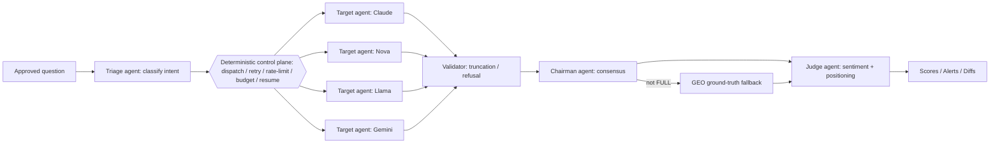
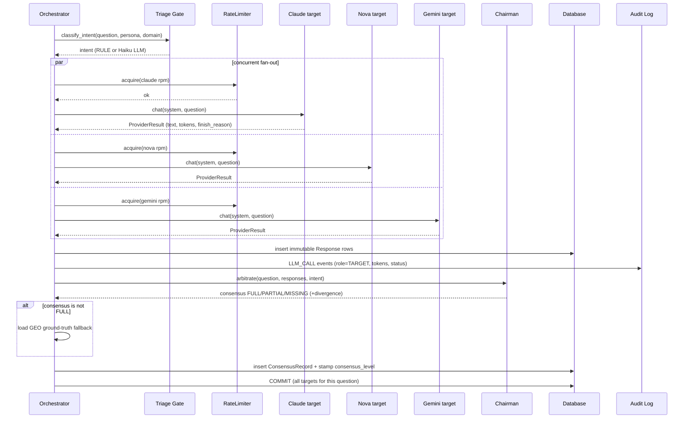
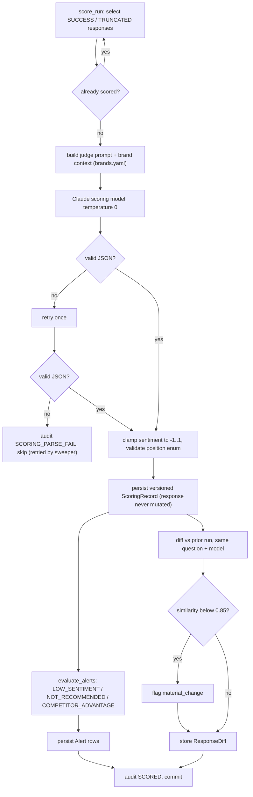
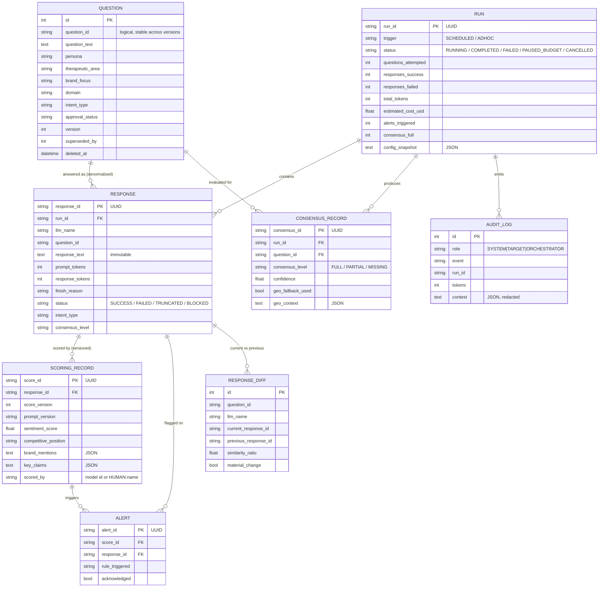

# Evidence Monitoring Agent — Technical Design Document

> **Status:** POC · **Audience:** Engineers, reviewers, Medical Affairs stakeholders
> **Scope:** Full technical description of the system, its components, data model, and the
> end-to-end product flow from triggering a monitoring run to surfacing results in the dashboard.

---

## Table of Contents

1. [What the product does](#1-what-the-product-does)
2. [Technology stack](#2-technology-stack)
3. [System architecture](#3-system-architecture) · [The agentic model](#the-agentic-model)
4. [Core concepts & glossary](#4-core-concepts--glossary)
5. [End-to-end product flow](#5-end-to-end-product-flow)
6. [Component deep-dives](#6-component-deep-dives)
7. [Data model](#7-data-model)
8. [API reference](#8-api-reference)
9. [Frontend / dashboard](#9-frontend--dashboard)
10. [Configuration](#10-configuration)
11. [Deployment](#11-deployment)
12. [Security, privacy & compliance](#12-security-privacy--compliance)

---

## 1. What the product does

The **Evidence Monitoring Agent** monitors *what large language models say about pharmaceutical
therapies*. It submits a curated, Medical-Affairs-approved bank of questions to multiple LLMs,
captures every answer immutably, then uses a "judge" LLM to score each answer for **brand
sentiment** and **competitive positioning**. It evaluates **cross-model consensus**, fires
**alerts** on concerning findings, detects **drift** between runs, and surfaces everything in a
React dashboard.

**Why:** Patients, prospects, and providers increasingly ask AI assistants about treatments. If a
model misrepresents a therapy, recommends a competitor, or hallucinates safety data, the
manufacturer needs to know. This system provides a repeatable, auditable measurement of that
exposure across models, personas, and therapeutic areas.

**POC boundaries:**

- Runs locally on **SQLite** with **Amazon Bedrock** as the live LLM provider.
- All brand/persona/question data is **synthetic but realistic** (real brand names, no PII).
- The therapeutic content shipped in config is **Immunology** (Humira, Skyrizi, Rinvoq),
  **Oncology** (Imbruvica, Venclexta), **Rheumatology** (Rinvoq, Humira), and the **Lupron**
  franchise — Central Precocious Puberty (Lupron Depot-Ped), Endometriosis and Uterine Fibroids
  (Lupron Depot).
- A single-container EC2 deploy via Bitbucket Pipelines exists; managed cloud infra is aspirational.

---

## 2. Technology stack

### Backend (`backend/`)

| Layer | Choice | Notes |
|-------|--------|-------|
| Language | Python 3.11+ | async throughout |
| Web framework | **FastAPI** `0.115.6` | routers under `app/api/` |
| ASGI server | **uvicorn** `0.34.0` | |
| ORM | **SQLAlchemy 2.0** (async) | `aiosqlite` driver for SQLite |
| Validation | **Pydantic v2** + `pydantic-settings` | request/response schemas + env settings |
| LLM provider (live) | **boto3 / Bedrock Converse API** | Claude, Nova, Llama via one path |
| LLM provider (live) | **google-genai** | Gemini via API key or Vertex AI |
| Config | **PyYAML** | targets, brands, prompts, routing, pricing |
| Scheduling | **APScheduler** (dependency present) | cron-style scheduled runs |
| Tests | **pytest** + `pytest-asyncio` | |

### Frontend (`frontend/`)

| Layer | Choice |
|-------|--------|
| Framework | **React 18** + **TypeScript** |
| Build tool | **Vite 6** |
| Routing | **react-router-dom 6** |
| Charts | **Recharts** |
| Icons | **lucide-react** |
| Styling | **Tailwind CSS 3** |
| Markdown | **react-markdown** + **remark-gfm** |

The Vite dev server proxies `/api/*` to the backend on port 8000. In production, nginx does the
same with the `/api` prefix stripped.

### Deployment

Single Docker image (multi-stage): **node** builds the SPA → **python** runtime runs uvicorn +
nginx + supervisord on port 80. CI/CD via **Bitbucket Pipelines** to a single **EC2** host.

---

## 3. System architecture

The system has six logical subsystems that map onto the SRS layers (Question Repository, Response
Agent, Response Repository, Scoring/Intelligence, Scheduling, Dashboard), plus two cross-cutting
governance layers (GEO ground-truth and the append-only audit log).

```text
                          ┌──────────────────────────────────────────────────────────┐
                          │                     React Dashboard (Vite)                │
                          │  Overview · Responses · Compare · Runs · Questions         │
                          └───────────────────────────┬──────────────────────────────┘
                                                       │  /api/*  (REST/JSON)
                          ┌───────────────────────────▼──────────────────────────────┐
                          │                  FastAPI app (app/main.py)                 │
                          │  routers: health questions runs responses scores analytics geo
                          └───┬───────────────┬───────────────┬────────────────┬───────┘
                              │               │               │                │
                ┌─────────────▼──┐  ┌─────────▼─────────┐  ┌──▼──────────┐  ┌──▼───────────┐
                │ Question Repo  │  │   Run Engine /    │  │  Scoring    │  │  Analytics / │
                │ (versioned,    │  │   Orchestrator    │  │  Engine     │  │  Query svcs  │
                │  approved)     │  │  dispatch·retry·  │  │ (Claude     │  │  (read-time  │
                │                │  │  rate-limit·resume│  │  judge)     │  │  score join) │
                └────────────────┘  │  ·budget·cancel   │  └──┬──────────┘  └──────────────┘
                                     └───┬────────┬──────┘     │
                       Triage Gate ◀─────┘        │            ├─▶ Alert Engine
                  (intent classifier)             │            └─▶ Differ (drift)
                                                   │
                                     ┌─────────────▼───────────────┐
                                     │   Provider abstraction       │
                                     │   (ProviderClient contract)  │
                                     │  bedrock · google · openai*  │
                                     │            · open-evidence*  │   (* dormant)
                                     └─────────────┬───────────────┘
                                                   ▼
                                   LLM Targets: Claude · Nova · Llama · Gemini · GPT-4o · EvidenceMD
                                                   │
                  Chairman Consensus ◀─────────────┘   (multi-LLM arbitration → GEO fallback)

   Cross-cutting:  Response Repository (append-only)  ·  Audit Log (append-only)  ·  GEO schema data
```

### Key architectural principles

- **Provider-agnostic by contract** — `app/providers/base.py` defines one `ProviderClient`
  interface. Each target is pure YAML config naming a provider. The orchestrator is provider-blind:
  it only ever sees a `ProviderResult` or a normalized error. Adding a provider = one adapter class;
  enabling a target = a config + credential change, **zero core code changes** (NF-010).
- **Immutability + versioning** — responses are append-only and never mutated; derived data
  (sentiment, positioning) lives in separate, **versioned** `scoring_records` joined at read time.
- **Deterministic plumbing, LLM judgment where it counts** — retries, rate-limiting, budget,
  resume, and cancellation are deterministic Python. LLMs are used for the three jobs only a model
  can do: answering (targets), classifying intent (Triage Gate), and judging (Chairman + Scorer).
- **Append-only audit** — every external call is logged with a role tag (`TARGET`,
  `ORCHESTRATOR`, `SYSTEM`) and credential redaction.
- **Content-agnostic code** — all brand/competitor/therapy knowledge lives in `config/`, never in
  code (SE-007).

### The agentic model

The orchestrator is **not** a single monolithic prompt. The system is a **multi-agent architecture**:
a deterministic Python **control plane** coordinates several specialized **LLM agents**, each invoked
only where genuine judgment is required (FR-202). This is the project's defining "agentic" piece — the
reason it is an *agent*, not a script.

**Two planes.** The **control plane** (deterministic, testable, fully audited) owns dispatch,
concurrency, retry/backoff, per-target rate limiting, the token budget, resume, and cooperative
cancellation. The **judgment plane** (LLM agents) owns the decisions only a model can make: what a
question *means*, whether an answer is complete, whether the models *agree*, and how a brand is
*positioned*.

**Agent roster** (every model is config-driven via `targets.yaml`):

| Agent | Model (config role) | Audit role | What it decides |
|-------|---------------------|-----------|-----------------|
| **Triage agent** | Claude Haiku (orchestrator) | `ORCHESTRATOR` | Question intent (CLINICAL / EXPERIENTIAL / SCREENING / SHORTHAND) when deterministic rules are uncertain |
| **Target agents** | Claude · Nova · Llama · Gemini | `TARGET` | The systems *under observation* — answer each question under a persona system prompt |
| **Validator agent** | Claude Haiku (orchestrator) | `ORCHESTRATOR` | Whether an ambiguous answer is truncated / a refusal |
| **Chairman agent** | Claude Haiku (orchestrator) | `ORCHESTRATOR` | Cross-model consensus (FULL / PARTIAL / MISSING) + when to pull GEO ground truth |
| **Judge agent** | Claude Sonnet (scoring) | `ORCHESTRATOR` | Brand sentiment + competitive positioning of each response |

Every LLM call is tagged `role=ORCHESTRATOR` (a coordinating agent) or `role=TARGET` (a system under
test) in the audit log, so the model doing the *judging* is always distinguishable from the model
being *measured* (IN-302).

**Intent-driven, persona-aware behavior** — the agent adapts per question instead of treating them all
alike (the "Patient / Provider / Prospect intent" angle):

- **Persona** selects the system prompt *and* which target agents are queried (`target_routing.yaml`).
- **Intent** changes downstream rigor: `CLINICAL` → the Chairman evaluates consensus in *strict*
  mode; `SHORTHAND` → arbitration is skipped; uncertainty escalates from rules to the LLM triage agent.

**Design pattern:** orchestrator–workers + evaluator/judge + arbitrator — deterministic where
auditability and cost control matter, LLM judgment where it counts.



**The per-question agent loop** (condensed; full mechanics in §5.4–5.7):

1. **Triage agent** classifies intent (Layer-1 rules → Layer-2 LLM fallback).
2. **Control plane** fans out to the persona's **target agents** concurrently, within rate limits and
   the retry policy.
3. **Validator** flags truncation; the control plane retries once with a higher token cap.
4. **Chairman agent** arbitrates consensus across the answers; on divergence it pulls **GEO**
   ground-truth context.
5. **Control plane** commits all target outputs + the consensus record atomically (per question).
6. *(post-run)* the **Judge agent** scores every response; the deterministic **alert** and **diff**
   engines then run.

---

## 4. Core concepts & glossary

| Term | Meaning |
|------|---------|
| **Question** | A Medical-Affairs-approved prompt, tagged with `persona`, `therapeutic_area`, `brand_focus`, `domain`. Versioned and approvable. |
| **Persona** | The simulated asker: `Prospect`, `Patient`, or `Provider`. Drives the system prompt and target routing. |
| **Domain** | Question category: `Efficacy`, `Safety`, `Access`, `Comparative`, `General`. |
| **Target** | A configured LLM endpoint (e.g. `claude`, `nova-pro`, `llama`, `gemini`). |
| **Run** | One execution batch (ad-hoc or scheduled) over a filtered set of questions × targets. |
| **Response** | One immutable record = answer of one target to one question within one run. |
| **Intent** | Triage-Gate classification of a question: `CLINICAL`, `EXPERIENTIAL`, `SCREENING`, `SHORTHAND`. |
| **Scoring record** | Versioned derived analysis of a response: sentiment, competitive position, brand mentions, key claims, rationale. |
| **Consensus** | Chairman arbitration of agreement across models for a question: `FULL`, `PARTIAL`, `MISSING`. |
| **Alert** | A triggered rule on a scoring record: `LOW_SENTIMENT`, `NOT_RECOMMENDED`, `COMPETITOR_ADVANTAGE`. |
| **Diff** | Similarity/material-change detection vs the previous run's answer to the same (question, model). |
| **GEO data** | Verified ground-truth brand schema (`llms.txt` + JSON-LD) used as a fallback when models diverge. |

### Response status taxonomy

`SUCCESS` · `TRUNCATED` (cut off; retried once with a higher token cap) · `BLOCKED` (provider
safety filter) · `FAILED` (transient/rate-limit retries exhausted, or fatal/auth error).

### Run status taxonomy

`RUNNING` · `COMPLETED` · `FAILED` · `PAUSED_BUDGET` (token cap hit) · `CANCELLED` (operator stop).

---

## 5. End-to-end product flow

This is the heart of the document: exactly what happens, in order, from the moment a run is
triggered to the moment a user reads the scored results.

### 5.1 Phase overview

```text
  [A] Seed / approve questions        (one-time / ongoing, Medical Affairs)
        │
  [B] Trigger run  ──▶  POST /runs ──▶ Run row (RUNNING) + background task
        │
  [C] Orchestration (per question, all targets concurrent):
        Triage Gate → fan-out to targets → capture responses → Chairman consensus → commit
        │
  [D] Budget / cancellation checks between questions → run reaches COMPLETED
        │
  [E] Scoring pass (Claude judge): sentiment + positioning + alerts + diff per response
        │
  [F] Dashboard read: analytics endpoints join latest score version → charts, tables, drawers
```

### 5.2 Phase A — Question bank (prerequisite)

Before any run, the Question Repository must hold **active, APPROVED** questions.

- `backend/scripts/seed_questions.py` loads **120+ synthetic questions** (≈40 per persona across 2
  therapeutic areas × 5 domains), including deliberate **divergence-triggering** and **SHORTHAND**
  questions to exercise the Chairman and Triage Gate. Each is pre-classified by Layer-1 intent
  rules and marked `APPROVED` by a mock approver.
- Questions can also be created/edited via the API (`POST /questions`, CSV import) with a **PII
  lint** gate (`app/utils/pii_lint.py`) that rejects SSN/MRN/DOB/email/phone/date patterns.
- Editing a question creates a **new version row**; the old row is marked `superseded_by` so history
  is preserved (`question_service.update_question`).

Only questions matching `active = True AND approval_status = 'APPROVED' AND deleted_at IS NULL AND
superseded_by IS NULL` are eligible for a run (`orchestrator._fetch_questions`).

### 5.3 Phase B — Triggering a run

1. In the **Runs** page the user picks optional `persona` / `therapeutic_area` / `domain` filters
   and clicks **Run Now** (or **Dry Run**).
2. The frontend calls `POST /api/runs` with a `RunCreate` body
   (`{ trigger, persona?, therapeutic_area?, domain?, dry_run }`).
3. `api/runs.py:create_run` → `run_service.create_run` inserts a `Run` row with a UUID and
   `status = RUNNING`, returns **HTTP 202** immediately.
4. The actual work is registered as a FastAPI **`BackgroundTask`**:
   `background_tasks.add_task(run_service.run_in_background, run_id, data)`. The HTTP request
   returns right away; the run executes asynchronously inside the API process.

`run_in_background` (`services/run_service.py`) is the top-level coordinator:

- Opens a fresh async DB session and calls `execute_run(...)`.
- If it was a **dry run** or the run ended `PAUSED_BUDGET`, it stops (no scoring).
- On any exception it marks the run `FAILED` and records the error in `run.notes`.
- Otherwise it opens **a second session** and runs the scoring pass `score_run(run_id)`.

### 5.4 Phase C — Orchestration (`agent/orchestrator.py:execute_run`)

This is the run engine. It is **idempotent per `(run, question, target)`** so an interrupted run can
be safely resumed.

**Setup:**

1. Load the `Run`, the list of `enabled_targets()`, per-persona system prompts, a
   `RateLimiterRegistry`, and a `BudgetGuard(max_tokens_per_run)`. `budget.used` is seeded from
   `run.total_tokens` so resumed runs respect the cap.
2. `_fetch_questions(...)` selects eligible questions with the optional filters applied.
3. `_existing_pairs(run_id)` loads already-stored `(question_id, llm_name)` pairs (resume support).
4. A `config_snapshot` (targets + filters + dry_run flag) is serialized onto the run, and
   `questions_attempted` is set. An audit event `RUN_START` is written.

**Dry run short-circuit (FR-209):** if `dry_run` is true, it only calls `health_check` on each
target, audits the result, marks the run `COMPLETED`, and returns — **nothing is written to the
Response Repository.**

**Main loop — for each question, in order:**

```text
  for q in questions:
    1. cancellation check  ── if requested → status=CANCELLED, persist, return
    2. Triage Gate:    intent = classify_intent(q.text, q.persona, q.domain)
                       (Layer-1 rules → Layer-2 Claude Haiku if uncertain); backfill q.intent_type
    3. system_prompt = prompts[q.persona]
    4. targets = targets_for_persona(q.persona)        # target_routing.yaml
    5. CONCURRENT fan-out (asyncio.gather over targets):
         process_target(t):
           - skip if (q.id, t.name) already stored (resume)
           - _call_target_with_retry(t, system, q.text, limiter):
                * rate-limit token-bucket acquire (per target rpm)
                * client.chat(model_id, system, user, params)
                * status = TRUNCATED if looks_truncated(result) else SUCCESS
                * SafetyBlocked → BLOCKED ; RateLimited/Transient → backoff [2,4,8]s retry ; else FAILED
           - if TRUNCATED → _handle_truncation: retry once with max_tokens*2 (cap 4096)
    6. for each outcome:
           - build immutable Response row (status, tokens, finish_reason, intent_type, ...)
           - run.total_tokens += tokens ; run.estimated_cost_usd += estimate_cost(model, in, out)
           - increment success/truncated/blocked/failed counters
           - budget.add(tokens) ; write_audit(role=TARGET, event=LLM_CALL, ...)
       db.flush()
    7. Chairman Consensus:
           - gather this question's stored responses
           - chairman_arbitrate(...) → FULL | PARTIAL | MISSING (+ divergence, confidence)
           - if level != FULL → attach GEO ground-truth fallback context
           - persist ConsensusRecord ; stamp consensus_level on all responses
           - increment run.consensus_full / _partial / _missing
    8. db.commit()      # FR-204: all targets for one question commit together
    9. if budget.exceeded() → status=PAUSED_BUDGET, persist, audit, return
```

After the loop completes without pausing/cancelling, the run is marked `COMPLETED`, `ended_at` is
set, and a `RUN_COMPLETE` audit event with the success/failure/token/cost summary is written.

**Why per-question commit?** It guarantees that for any given question, either all targets'
responses *and* the consensus record are persisted together, or none are — so the dashboard never
shows a half-answered question.

### 5.5 Phase C sequence diagram (one question)



### 5.6 Phase E — Scoring pass (`scoring/scorer.py:score_run`)

Once a run reaches `COMPLETED`, `run_in_background` opens a new session and scores it. Scoring is
**separate** from response capture so that (a) responses are stored fast and immutably, and (b)
scoring can be re-run or re-versioned later without touching the originals.

For every `SUCCESS`/`TRUNCATED` response not already scored:

1. **Build the judge prompt** (`_build_prompt`): a strict system prompt instructing the judge to
   return *only* JSON, plus brand/competitor context for the response's therapeutic area pulled
   from `config/brands.yaml`, the user question, and the (truncated) assistant answer.
2. **Call the scoring model** (Bedrock Claude by config) at `temperature 0`. On a parse/transport
   failure it retries once; a second failure audits `SCORING_PARSE_FAIL` and skips (the response
   stays unscored and is retried by the sweeper later).
3. **Validate & clamp**: `competitive_position` must be one of the five allowed enums (else
   `NOT_MENTIONED`); `sentiment_score` is clamped to `[-1.0, 1.0]`.
4. **Persist a versioned `ScoringRecord`** (`score_version` increments per response; the immutable
   response is never modified — FR-304).
5. **Evaluate alerts** (`alert_engine.evaluate_alerts`) and persist any `Alert` rows.
6. **Compute drift** (`_compute_response_diff`): find the most recent prior answer to the same
   `(question_id, llm_name)` from a *different* run, compute a similarity ratio, flag a **material
   change** if similarity `< 0.85`, and store a `ResponseDiff` with the unified diff text.
7. Commit per response, then write a `SCORED` audit event.

A separate **sweeper** (`score_unscored_sweep`, `POST /scores/sweep`) can score any leftover
unscored responses across all runs, and **re-scoring** (`POST /scores/rescore`) creates new score
*versions* with a new `prompt_version` rather than overwriting.

### 5.7 Scoring flow diagram



### 5.8 Phase F — Reading results in the dashboard

The dashboard polls REST endpoints; all analytics/query endpoints **join the latest score version
at read time** (`response_service._latest_scores_map`, `analytics._latest_scores_join`) so the
immutable response and its newest derived score are presented together.

- **Overview** calls seven analytics endpoints to render sentiment-by-LLM, competitive positioning,
  response volume over time, intent distribution, consensus breakdown, alerts-by-rule, and headline
  stats.
- **Responses** lists stored responses with filters (LLM, therapy, persona, intent, consensus,
  alerts-only) and opens a detail drawer with the full answer, scoring rationale, key claims,
  alerts, Chairman consensus + GEO fallback, and the run-over-run diff.
- **Compare** shows every model's latest answer to one question side by side.
- **Runs** polls `/runs` every 4 seconds for **live progress** (counts, tokens, cost, consensus)
  and supports cancel.
- **Questions** shows the approved bank and coverage-by-persona/TA/domain.

---

## 6. Component deep-dives

### 6.1 Question Repository

**Files:** `models/question.py`, `services/question_service.py`, `api/questions.py`,
`utils/pii_lint.py`, `scripts/seed_questions.py`.

- A question carries a stable logical `question_id` plus an integer surrogate `id`, the prompt text,
  and the four tags (`persona`, `therapeutic_area`, `brand_focus`, `domain`). It also stores
  `intent_type` (backfilled by the Triage Gate), an approval workflow (`approval_status`,
  `approver_name`), versioning (`version`, `superseded_by`), and soft-delete (`deleted_at`,
  `delete_reason`).
- **Versioning:** `update_question` never edits in place. It writes a new row with the same logical
  `question_id`, `version + 1`, and points the old row's `superseded_by` at the new row's `id`. Only
  current (non-superseded) rows are eligible for runs.
- **Soft delete:** `soft_delete_question` stamps `deleted_at` + reason and flips `active` off;
  rows are never physically deleted.
- **PII gate:** create/update/CSV-import paths run `scan_for_pii` (regex for SSN, MRN, DOB, email,
  phone, full dates). Hits are rejected (API) or skipped with a reason (CSV import).
- **Coverage report** (`/questions/coverage-gaps`) aggregates approved-active counts by persona, TA,
  and domain — used by the dashboard's Questions page and to evidence acceptance criteria.

### 6.2 Provider abstraction layer

**Files:** `providers/base.py`, `providers/bedrock.py`, `providers/google_client.py`,
`providers/openai_client.py`, `providers/open_evidence.py`, `providers/registry.py`.

The contract in `base.py` is the backbone of the "swap a model via config" promise:

- **`ProviderClient`** (ABC) — every provider implements `async chat(model_id, system, user,
  params) -> ProviderResult` and `async health_check(model_id) -> HealthStatus`.
- **`ModelParams`** — `max_tokens`, `temperature`, and a free-form `extra` dict.
- **`ProviderResult`** — normalized `text`, `finish_reason` (`stop|length|blocked|error`),
  `prompt_tokens`, `completion_tokens`, `model_version`, `raw_status`, `block_reason`.
- **Normalized error taxonomy** — every provider maps its native failures into:
  `RateLimited` (429/throttle → backoff retry), `Transient` (5xx/timeout → backoff retry),
  `SafetyBlocked` (content filter → `BLOCKED`), `AuthError` (creds → fail fast), `Fatal`
  (non-retryable). This is what lets the orchestrator stay completely provider-blind.

**Bedrock (`bedrock.py`)** — the live workhorse. Uses the **Converse API** so a single code path
covers Claude, Nova, Llama, etc. boto3 is synchronous, so calls run in a thread via
`asyncio.to_thread`. boto3's own retries are disabled (`max_attempts: 0`) because the orchestrator
owns retry policy. Error codes are mapped into the taxonomy; `content_filtered` /
`guardrail_intervened` stop reasons raise `SafetyBlocked`.

**Google (`google_client.py`)** — Gemini via the `google-genai` SDK, with two auth modes tried in
order: **API key** (`GOOGLE_API_KEY`) then **Vertex AI** (project + service-account/ADC). The SDK is
imported lazily so the module loads even when the dependency is absent and the target is disabled.
Safety blocks and finish reasons map into the shared taxonomy. `max_tokens` is set high because
Gemini "thinking" models spend output tokens on internal reasoning.

**OpenAI & Open Evidence** — interface-compliant **dormant** stubs. They raise `NotImplementedError`
/ `Fatal` until enabled. Activating them is purely a `targets.yaml` `enabled: true` + credential
change — no orchestrator/scoring code changes (NF-010).

**Registry (`registry.py`)** — loads `targets.yaml`, builds `Target` dataclasses, and caches one
client per provider. Helper functions: `enabled_targets()`, `targets_for_persona(persona)` (applies
`target_routing.yaml`), and `get_orchestrator_config()` / `get_scoring_config()` for the
judge/coordinator models.

### 6.3 Run engine / Orchestrator

**File:** `agent/orchestrator.py` (covered procedurally in §5.4). Supporting deterministic services:

- **Rate limiter (`agent/rate_limiter.py`)** — an async **token-bucket** per target, sized by the
  target's `rpm`. `RateLimiterRegistry` holds one bucket per target name; `acquire()` blocks until a
  slot is free. This caps request rate independently per model.
- **Budget guard (`agent/budget.py`)** — `BudgetGuard` accumulates tokens against
  `MAX_TOKENS_PER_RUN`; when exceeded the run is paused (`PAUSED_BUDGET`) between questions.
  `estimate_cost(model_id, in, out)` prices each call from `config/pricing.yaml` (with a default
  fallback) to populate `run.estimated_cost_usd`.
- **Cancellation (`agent/cancellation.py`)** — an in-process set of run IDs. `POST /runs/{id}/cancel`
  adds the ID; the orchestrator checks `is_cancel_requested()` **between questions** and stops
  cleanly, preserving everything already captured (NF-005).
- **Validator (`agent/validator.py`)** — `looks_truncated(result)` is the cheap deterministic
  heuristic (finish_reason `length`, or text ending mid-clause without terminal punctuation) used to
  flag `TRUNCATED`. An optional `classify_with_orchestrator` can escalate ambiguous cases to the
  Claude orchestrator model for an `OK|TRUNCATED|REFUSAL` verdict.
- **Retry/truncation policy** — `_call_target_with_retry` retries `RateLimited`/`Transient` with
  `[2, 4, 8]`-second backoff; `_handle_truncation` retries a truncated answer **once** with double
  the `max_tokens` (capped at 4096).

### 6.4 Triage Gate (intent classifier)

**Files:** `agent/intent_classifier.py`, `config/intent_rules.yaml`.

A **two-layer hybrid** classifier that runs before dispatch:

- **Layer 1 (deterministic):** SHORTHAND regex patterns (single drug name, "X vs Y", `MOA`, `PFS`,
  `ORR`, `TLS`, …) override everything; otherwise a `(persona, domain) → intent` lookup from
  `intent_rules.yaml`. Returns `None` (UNCERTAIN) if no rule matches.
- **Layer 2 (LLM):** only for UNCERTAIN cases — a tiny Claude Haiku call returns exactly one of
  `CLINICAL | EXPERIENTIAL | SCREENING | SHORTHAND`. Defaults safely to `SCREENING` on failure.

Intent drives two things downstream: the **Chairman's strictness** (CLINICAL → strict consensus
evaluation; SHORTHAND → arbitration skipped) and dashboard **intent analytics**. The result is
backfilled onto the question row.

### 6.5 Chairman Consensus & arbitration

**Files:** `agent/chairman.py`, `models/consensus.py`.

After all targets answer a question, the **Chairman** (the orchestrator Claude model) judges whether
the models agree:

- Requires **≥2 valid** (`SUCCESS`/`TRUNCATED`) responses; otherwise records `MISSING`.
- **SHORTHAND** intent skips arbitration (records a trivial `FULL`).
- Builds a prompt embedding each model's answer (truncated to 3000 chars) and asks for strict JSON:
  `consensus_level` (`FULL|PARTIAL|MISSING`), `agreed_recommendation`, `divergence_points[]`,
  `confidence`. CLINICAL questions use a stricter evaluation mode.
- **GEO fallback:** when consensus is **not FULL**, it loads verified ground-truth schema data for
  the brand (§6.9) and attaches it to the consensus record — the governance answer to "the models
  disagree, what's actually true?"
- Persists one `ConsensusRecord` per `(run, question)` (unique constraint) and stamps
  `consensus_level` onto every response for that question; run-level counters
  (`consensus_full/partial/missing`) are incremented.

### 6.6 Scoring engine

**Files:** `scoring/scorer.py`, `models/scoring.py` (covered procedurally in §5.6).

Output schema per response (versioned in `scoring_records`):

| Field | Meaning |
|-------|---------|
| `sentiment_score` | float in `[-1.0, 1.0]` toward the focus brand |
| `competitive_position` | one of FIRST_LINE_RECOMMENDED / AMONG_OPTIONS / SECOND_LINE / NOT_RECOMMENDED / NOT_MENTIONED |
| `brand_mentions` | list of `{brand, is_competitor, sentiment}` |
| `key_claims` | up to 5 short claim strings |
| `scoring_rationale` | brief free-text justification |

Properties worth noting: scoring is **idempotent within a run** (skips responses that already have a
record), **versioned** (`score_version` increments; re-scores add versions rather than overwrite),
and **fault-tolerant** (one retry, then audit-and-skip so a single bad parse can't fail the batch).
Human reviewers can override a score via `POST /scores/{id}/override`, which writes a new
`HUMAN:<name>` version — the AI score is preserved.

### 6.7 Alert engine

**Files:** `scoring/alert_engine.py`, `models/alert.py`.

Three deterministic rules evaluated per scoring record:

- **`LOW_SENTIMENT`** — `sentiment_score < -0.3`.
- **`NOT_RECOMMENDED`** — focus brand classified `NOT_RECOMMENDED`.
- **`COMPETITOR_ADVANTAGE`** — a competitor brand mention has sentiment exceeding the focus brand's
  by `≥ 0.4`.

Each hit becomes an `Alert` row linked to both the response and the score version. The Overview page
renders an alerts-by-rule breakdown; the Responses table flags alerting rows and the detail drawer
lists the specific rule + reason.

### 6.8 Differ / drift detection

**Files:** `scoring/differ.py`, `models/response_diff.py`.

For each newly scored response, the scorer finds the most recent prior answer to the same
`(question_id, llm_name)` from a **different run** and computes a `difflib.SequenceMatcher`
similarity ratio plus a unified diff. Similarity `< 0.85` flags a **material change**. The result is
stored as a `ResponseDiff` and surfaced in the response detail drawer ("Change vs Previous Run").
This is how the system detects when a model's stance on a therapy drifts over time.

> Note: drift detection is currently **lexical** (sequence similarity), not semantic embeddings —
> a known POC simplification.

### 6.9 GEO governance layer

**Files:** `geo/loader.py`, `api/geo.py`, `config/geo/llms.txt`, `config/geo/schema/*.json`.

The **Generative Engine Optimization (GEO)** layer is the verified ground-truth corpus:

- **`llms.txt`** — a machine-readable, human-curated summary of each brand (type, route,
  indications, key efficacy, safety profile, dosing, biosimilars) served at `/geo/llms.txt`.
- **JSON-LD `schema/*.json`** — structured `schema.org/Drug` records per brand (indications,
  `clinicalEfficacy`, `adverseOutcome` with severity, `dosingProtocol`, `competitorContext`) served
  at `/geo/schema/{brand}`.
- The loader maps brand **and** generic names (e.g. `venclexta`/`venetoclax`) to a schema file and
  assembles a compact context object used as the Chairman's fallback when models diverge.

Purpose is twofold: (1) give the Chairman an authoritative reference when LLMs disagree, and (2)
publish the brand's own structured truth in the formats AI crawlers consume.

### 6.10 Audit, logging & redaction

**Files:** `utils/audit.py`, `utils/logging.py`, `models/audit_log.py`.

- **Append-only audit log** — `write_audit` records every meaningful event (`RUN_START`,
  `LLM_CALL`, `SCORED`, `RUN_COMPLETE`, `RUN_CANCELLED`, `RUN_PAUSED_BUDGET`, `DRY_RUN_HEALTH`,
  `SCORING_PARSE_FAIL`) with a **role tag** (`SYSTEM`, `TARGET`, `ORCHESTRATOR`), the run/question/
  target, HTTP status, tokens, and a JSON context. Rows are never updated.
- **Credential redaction** — both audit context and structured logs pass through `redact()`, which
  masks AWS keys, `api_key`/`secret`/`password` assignments, and OpenAI-style `sk-…` tokens
  (SE-006). Logs are emitted as JSON (`JsonFormatter`) for ingestion.

### 6.13 Social Listening (complementary surface)

**Files:** `social/pipeline.py`, `social/classify.py`, `harvest/sources/apify.py`,
`services/social_service.py`, `api/social.py`, `models/social_post.py`, `models/social_comment.py`,
`config/social_sources.yaml`.

Separate from the monitoring run pipeline, Social Listening scrapes public social **posts and their
comments/replies** via Apify actors (one per channel, plus a per-channel comments actor that takes a
post URL). Each item is PII/PHI-redacted, prompt-injection-screened, and run through the fail-closed
adverse-event backstop, then LLM-scored for sentiment/brand/TA/topic. The same classification call
**detects the source language and returns an English translation** (`text_en`) — always on
already-redacted text — so non-English content is searchable/scorable in English and shown with a
"Show original" toggle. **Comment sentiment is a separate dimension** from post sentiment: comments
persist in `social_comments` and roll an average comment sentiment onto each post. A bounded comments
pass (top-engagement posts per channel, capped per post, concurrency-limited) keeps the all-channels
cost demo-sized. AE signals from posts and comments both route for pharmacovigilance review. Posts
and comments mirror to Snowflake (`SOCIAL_POSTS`, `SOCIAL_COMMENTS`, `VW_SOCIAL_*`) and are covered by
the Cortex semantic model. Live ingest requires `APIFY_API_TOKEN`; the dashboard works read-only
without it.

---

## 7. Data model

**Engine:** async SQLAlchemy 2.0 over SQLite (`aiosqlite`). `init_db()` creates tables on startup
and applies lightweight additive SQLite migrations (`_migrate_sqlite_schema`) for columns added
after initial release (`intent_type`, `consensus_level`, run consensus counters).

### 7.1 Entity relationships



### 7.2 Immutability rules (the contract)

- **`responses`** rows are **append-only** — never `UPDATE`d or `DELETE`d in application code. The
  one mutation made post-insert is stamping `consensus_level` during the same run's commit (a
  deliberate, audited exception). A unique constraint on `(run_id, question_id, llm_name)` enforces
  one row per target per question per run and underpins **resume**.
- **`scoring_records`** are **versioned, not overwritten** — every (re)score or human override adds
  a new `score_version`. Read paths always project the **max version** per response.
- **`questions`** use copy-on-write versioning + soft delete (never physical delete).
- **`audit_log`** and **`alerts`** are append-only.

---

## 8. API reference

All routes are served under `/` by FastAPI and exposed to the SPA under the `/api` prefix
(stripped by the Vite/nginx proxy). Interactive docs at `/docs`.

### Health (`api/health.py`)

| Method | Path | Purpose |
|--------|------|---------|
| GET | `/health` | liveness |
| GET | `/health/targets` | per-target connectivity check (concurrent `health_check`) |

### Questions (`api/questions.py`)

| Method | Path | Purpose |
|--------|------|---------|
| GET | `/questions` | list with filters (persona, TA, brand, domain, approval, active) |
| GET | `/questions/coverage-gaps` | coverage counts by persona/TA/domain |
| GET | `/questions/{row_id}` | fetch one |
| POST | `/questions` | create (PII-linted) |
| PATCH | `/questions/{row_id}` | edit → new version (PII-linted) |
| DELETE | `/questions/{row_id}` | soft delete with reason |
| POST | `/questions/import-csv` | bulk import (PII lint per row) |

### Runs (`api/runs.py`)

| Method | Path | Purpose |
|--------|------|---------|
| GET | `/runs` | run history (newest first) |
| GET | `/runs/{run_id}` | one run |
| POST | `/runs` | trigger ad-hoc run (202, async) with optional filters |
| POST | `/runs/dry-run` | connectivity-only run (no stored responses) |
| POST | `/runs/{run_id}/cancel` | cooperative cancel of a `RUNNING` run |

### Responses (`api/responses.py`)

| Method | Path | Purpose |
|--------|------|---------|
| GET | `/responses` | filtered list with latest score projected |
| GET | `/responses/compare` | latest answer per LLM for a `question_id` |
| GET | `/responses/export` | CSV/JSON export of filtered results |
| GET | `/responses/{response_id}` | detail + alerts + diff + consensus |

### Scores (`api/scores.py`)

| Method | Path | Purpose |
|--------|------|---------|
| POST | `/scores/sweep` | score any unscored responses now |
| POST | `/scores/rescore` | re-score as new versions (`prompt_version`, optional `run_id`) |
| GET | `/scores/response/{response_id}` | all score versions for a response |
| POST | `/scores/{response_id}/override` | human override → new `HUMAN:` version |

### Analytics (`api/analytics.py`)

| Method | Path | Purpose |
|--------|------|---------|
| GET | `/analytics/sentiment-distribution` | avg sentiment by LLM and TA + buckets |
| GET | `/analytics/positioning` | competitive position counts by LLM |
| GET | `/analytics/volume` | response volume over time by status |
| GET | `/analytics/alerts-summary` | total alerts + breakdown by rule |
| GET | `/analytics/consensus-summary` | consensus by level/LLM + GEO fallback usage |
| GET | `/analytics/intent-distribution` | intent counts overall and by persona |
| GET | `/analytics/llm-comparison` | per-LLM counts + avg sentiment |

### GEO (`api/geo.py`)

| Method | Path | Purpose |
|--------|------|---------|
| GET | `/geo/llms.txt` | machine-readable brand summary |
| GET | `/geo/schema/{brand}` | JSON-LD `Drug` schema for a brand |
| GET | `/geo/brands` | brands with available schema |

---

## 9. Frontend / dashboard

**Files:** `frontend/src/App.tsx`, `pages/*.tsx`, `components/ui.tsx`, `api/client.ts`.

- **Shell (`App.tsx`)** — fixed sidebar nav (Overview, Responses, Compare, Runs, Questions) plus a
  global **persona filter** stored in a React context and synced to the URL query string, so the
  selected persona flows into the Responses query.
- **Typed API client (`api/client.ts`)** — thin `fetch` wrapper over `/api` exposing `Question`,
  `ResponseItem`, and `Run` interfaces and one function per endpoint.
- **Overview** — headline stats + six Recharts visualizations (sentiment by LLM, stacked
  positioning, volume line, intent pie, consensus bars, alerts-by-rule list).
- **Responses** — filterable table; row click opens a right-hand **drawer** rendering the full
  Markdown answer, scoring rationale, key-claim chips, alerts, the Chairman consensus block
  (with GEO-fallback notice and raw context), and the run-over-run diff.
- **Compare** — pick a question; see all models' latest answers side by side with sentiment/position
  badges and a divergence banner when consensus ≠ FULL.
- **Runs** — trigger Run Now / Dry Run with persona/therapy/domain filters; history table polls
  every 4s for live counts, tokens, cost, consensus tallies, and a Cancel action on running rows.
- **Questions** — coverage stat cards + the approved question bank table.
- **Shared UI (`components/ui.tsx`)** — `Card`, `Stat`, color-coded `SentimentBadge`,
  `PositionBadge`, `ConsensusBadge`, `IntentBadge`, and a styled `Markdown` renderer.

---

## 10. Configuration

All operational knobs live in `backend/app/config/` (YAML) and `.env` (secrets/IDs). Code is content
-agnostic (SE-007): brands, prompts, routing, and pricing are data, not code.

| File | Controls |
|------|----------|
| `targets.yaml` | LLM targets (provider, model_id, params, rate limits, enabled) + orchestrator/scoring model config. `${ENV}` interpolation. |
| `target_routing.yaml` | Which targets each persona is sent to (Patient/Prospect: public LLMs; Provider: + Open Evidence). |
| `brands.yaml` | Therapeutic areas, focus brands, competitors — injected into the scoring prompt. |
| `system_prompts.yaml` | Per-persona system prompts (Medical-Affairs reviewable). |
| `intent_rules.yaml` | `(persona, domain) → intent` map + SHORTHAND regex patterns. |
| `pricing.yaml` | Per-million-token input/output prices for cost estimation. |
| `geo/llms.txt`, `geo/schema/*.json` | GEO ground-truth corpus. |

**Settings (`config/settings.py`)** — Pydantic-settings reads `.env`: AWS creds/region,
`DATABASE_URL`, the five Bedrock model IDs (targets + orchestrator + scoring), `MAX_TOKENS_PER_RUN`,
default cron, and dormant-provider keys (`OPENAI_API_KEY`, `GOOGLE_API_KEY`, Vertex settings).

**Adding a new LLM target** (no core code change unless it's a new provider):

1. (New provider only) add a `ProviderClient` subclass and register it in `registry.py`.
2. Add a target block to `targets.yaml` with `enabled: true`.
3. Add any credential to `.env`.

---

## 11. Deployment

**Files:** `Dockerfile`, `deploy/nginx.conf`, `deploy/supervisord.conf`,
`deploy/.env.production.example`, `scripts/ec2_deploy.sh`, `bitbucket-pipelines.yml`,
`docs/deploy.md`.

### Local development

```bash
# Backend
pip install -r backend/requirements.txt
cd backend && python -m scripts.seed_questions          # seed the question bank
python -m uvicorn app.main:app --reload --port 8000     # API at :8000 (/docs)

# Frontend
cd frontend && npm install && npm run dev               # dashboard at :5173 (proxies /api)
```

### Production (single container)

A multi-stage Docker image builds the React SPA (node) and bundles it with the FastAPI backend
(python). At runtime **supervisord** runs **uvicorn** (`127.0.0.1:8000`) and **nginx** (port 80);
nginx serves the SPA and reverse-proxies `/api/*` → uvicorn (stripping `/api`), exactly mirroring the
dev proxy. A `HEALTHCHECK` curls `/healthz`.

### CI/CD

**Bitbucket Pipelines** runs tests on PRs and, on push to `main`: tests → `rsync` the working tree to
EC2 → SSH-run `ec2_deploy.sh` (docker build, swap container, idempotent DB seed) → smoke-test
`/healthz`. The SQLite DB lives on a host volume (`~/evidence-monitoring-agent/data/`) so it survives
redeploys; `.env` lives only on the host and is never committed.

---

## 12. Security, privacy & compliance

- **No PII by design** — synthetic questions only; a PII lint blocks SSN/MRN/DOB/email/phone/date
  patterns at every question entry point (SE-001).
- **Credential redaction** — secrets are masked in logs and audit context (SE-006); `.env` is never
  committed or rsynced; provider clients read keys only from settings.
- **Append-only audit trail** — every external LLM call and run lifecycle event is recorded with a
  role tag and token/cost accounting, supporting traceability and reproducibility (SE-003, IN-302).
- **Immutable evidence** — responses are never altered; derived scores are versioned, so the
  original model output and the analysis history are both preserved for review (FR-302/304).
- **Human-in-the-loop** — questions require Medical-Affairs approval before use; scores can be
  overridden by a named human reviewer without destroying the AI score (SE-002, FR-408).
- **Safety handling** — provider content-filter blocks are captured as a first-class `BLOCKED`
  status rather than silently dropped (IN-204).
- **Cost & blast-radius controls** — per-target rate limiting, a per-run token budget that pauses
  cleanly, and cooperative cancellation bound the cost and impact of any single run.

### Known POC simplifications

- Drift detection is **lexical** (`difflib`), not semantic embeddings.
- In-process background tasks + in-memory cancellation/rate-limit state (no external queue), so a
  process restart abandons in-flight runs (resume support mitigates re-execution cost).
- OpenAI and Open Evidence targets are **dormant** stubs.
- SQLite + single-container deploy; no managed DB, autoscaling, or multi-node concurrency.

---

*Generated as the technical reference for the Evidence Monitoring Agent POC. Cross-reference the
inline `FR-/NF-/SE-/IN-` tags with the SRS for requirement traceability.*
