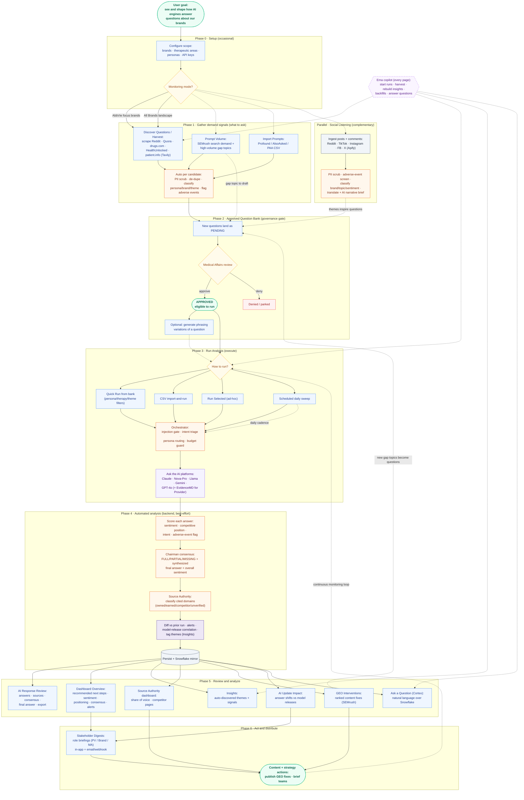

# End-to-End User Journey

This document maps the **whole product** as a user experiences it: the stages a user moves through to achieve what the platform is built for, which is to **see and shape how AI engines (Claude, Nova-Pro, Llama, Gemini, GPT-4o, plus EvidenceMD for clinicians) answer questions about your brands**.

It has two diagrams: a **journey overview** for the big picture, and a **detailed end-to-end flow** with every input source, the governance gate, the run, automated analysis, the review surfaces, distribution, and the improvement loops.

> Scope: the full app across the main navigation (`frontend/src/App.tsx`) and the `HowToUse` guide. For the run engine internals see [`RUN_ANALYSIS_FLOW.md`](./RUN_ANALYSIS_FLOW.md); for the system view see [`architecture.md`](./architecture.md).

## Legend

- **Terminal / goal** - rounded pill nodes are the user's goal or a place the work is consumed.
- **Process** - blue rectangles are things the user does or a page does for them.
- **Decision** - amber diamonds are branch points (mode, review, how to run).
- **Agent step** - orange nodes are automated AI/agent work (classify, score, consensus).
- **AI platforms** - purple node is the fan-out to the LLM targets.
- **Data / persist** - slate nodes are captured data and the analytics store.
- **Best-effort / optional** - dashed nodes and links never block the main flow if skipped.
- **Governance gate** - nothing runs until Medical Affairs approves it in the Question Bank.

---

## 1. Journey Overview

The core path from raw demand to action, the way most users describe it.

```mermaid
flowchart LR
  subgraph GATHER["1 · Gather demand"]
    direction TB
    G1["Discover Questions<br/>(Harvest)"]
    G2["Prompt Volume<br/>(SEMrush)"]
    G3["Import Prompts<br/>(CSV)"]
    G4["Social Listening"]
  end

  GATHER --> BANK["2 · Approved Question Bank<br/>Medical Affairs approve<br/>+ phrasing variations"]
  BANK --> RUN["3 · Run Analysis<br/>ask Claude · Nova-Pro · Llama ·<br/>Gemini · GPT-4o (+ EvidenceMD)"]
  RUN --> AUTO["4 · Auto-analysis<br/>score · consensus ·<br/>source authority · alerts"]
  AUTO --> REVIEW["5 · Review<br/>AI Response Review<br/>+ Insights dashboards"]
  REVIEW --> ACT(["6 · Act + distribute<br/>GEO interventions ·<br/>Stakeholder Digests"])
  ACT -.->|new gaps become questions| GATHER

  classDef src fill:#E0F2FE,stroke:#0284C7,color:#0C4A6E;
  classDef step fill:#F1F5F9,stroke:#475569,color:#1E293B;
  classDef out fill:#ECFDF5,stroke:#10B981,color:#065F46,font-weight:bold;
  class G1,G2,G3,G4 src;
  class BANK,RUN,AUTO,REVIEW step;
  class ACT out;
```

**Notes**

- The journey is a **loop**, not a straight line: gaps found in the dashboards feed new questions back into the bank for the next cycle.
- **Social Listening** is complementary intelligence that runs alongside the core flow; it has its own dashboard and can inspire new questions.
- A **daily scheduled run** keeps stages 3 to 5 turning automatically once the bank is approved.

---

## 2. Detailed End-to-End Flow

Every stage, decision, input source, output surface, and improvement loop, plus the always-on **Ema** copilot.

---

## 3. Where each stage lives in the app

| Stage | Navigation | What the user does |
| --- | --- | --- |
| 0 · Setup | Config + `.env` | Set brands / therapeutic areas / personas and API keys; pick a Monitoring Mode (AbbVie focus brands vs All Brands landscape). |
| 1 · Gather demand | Discover Questions, Prompt Volume, (Import Prompts), Social Listening | Harvest real questions from the web, pull SEMrush demand and gap topics, import prompt CSVs, and listen to social channels. Everything is PII-scrubbed, de-duplicated, classified, and adverse-event screened. |
| 2 · Approve bank | Approved Question Bank | Medical Affairs approves or denies PENDING questions (the governance gate). Optionally generate phrasing variations. Only APPROVED questions can run. |
| 3 · Run Analysis | Run Analysis (Standard Run / Phrasing Variation) | Launch a run on demand, from CSV, ad-hoc from the bank, or on a daily schedule. The orchestrator triages intent, routes by persona, and asks the AI platforms. Provider questions also query EvidenceMD automatically. |
| 4 · Auto-analysis | (backend) | Each answer is scored for sentiment, competitive position, intent, and adverse events; the Chairman computes consensus and a synthesized final answer; citations are classified; diffs, alerts, model-release correlation, and theme tagging run; data is mirrored to Snowflake. |
| 5 · Review + analyze | AI Response Review, Insights and Trends (Overview / Insights / Source Authority / GEO Interventions / AI Update Impact / Ask a Question) | Read scored answers with sources and consensus; track sentiment, positioning, and alerts; explore themes; see which domains the models cite; get ranked content fixes; check whether shifts line up with model releases; ask questions in plain English. |
| 6 · Act + distribute | GEO Interventions, Stakeholder Digests | Turn findings into content and strategy actions; send role-specific briefings (PV, Brand, Medical Affairs) in-app and by email or webhook. |

**Cross-cutting: Ema copilot** is available on every page and can start runs, run harvest, rebuild insights, run backfills, and answer questions about your data.

## 4. Key accuracy notes

- **Governance is mandatory.** Nothing runs until a question is APPROVED in the Question Bank, regardless of which source produced it.
- **Demand sources are independent.** Harvest, Prompt Volume, and Import Prompts each feed PENDING questions; you do not need all of them.
- **Social Listening is a parallel intelligence stream**, separate from the five-stage core flow; it has its own dashboard and can inspire new questions rather than feeding runs directly.
- **The AI platform set is config-driven.** The five public platforms answer every persona; EvidenceMD is added only for Provider-persona questions and only when its API key is set. The dashboards can hide retired targets.
- **Phase 4 is best-effort and runs after the run is already COMPLETED**, so a just-finished run can briefly show scores as pending in AI Response Review. See [`RUN_ANALYSIS_FLOW.md`](./RUN_ANALYSIS_FLOW.md) for the exact engine lifecycle and outcomes.
- **The loop is the point.** GEO gaps, Prompt Volume gaps, and social themes flow back into the bank, and a daily schedule keeps the cycle running with minimal manual effort.
