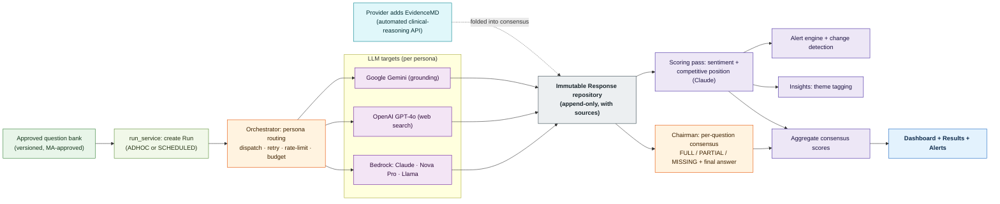
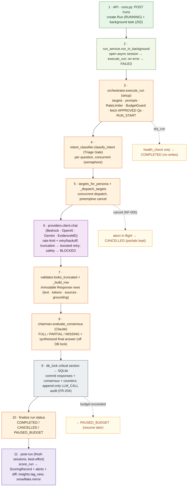
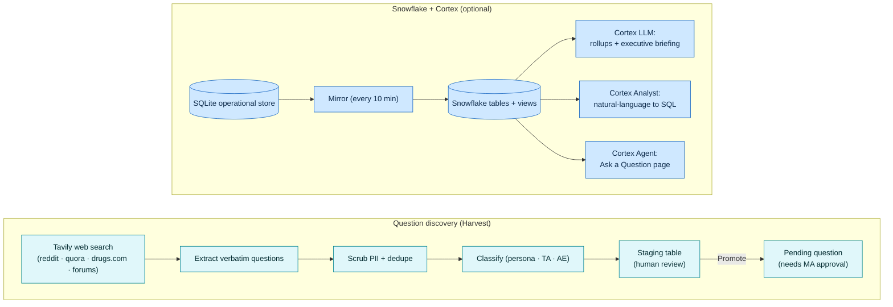
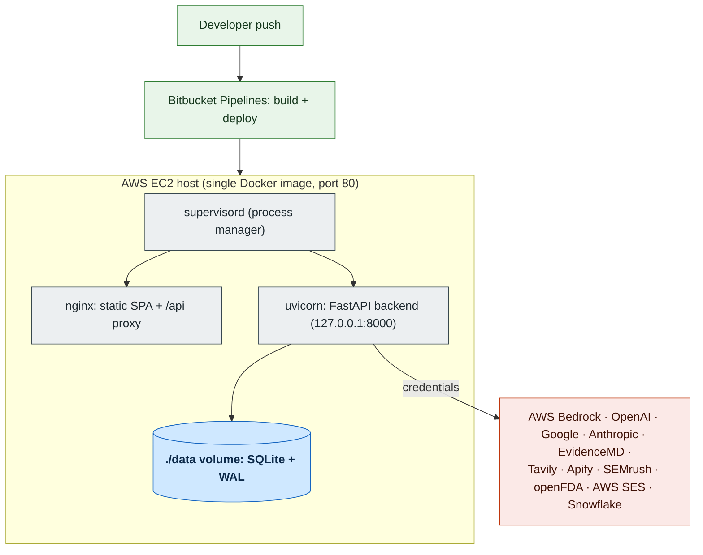

# Evidence Monitoring Agent: Architecture

This document describes the components of the Evidence Monitoring Agent and how they
fit together. The system submits a Medical-Affairs-approved question bank to multiple
LLMs across three personas (Prospect, Patient, Provider), stores every response
immutably (with the real web sources grounded models cite), scores brand sentiment and
competitive positioning, builds a council-of-LLMs consensus, mines new patient questions
from the public web, monitors public social chatter, and layers on generative-engine
optimization surfaces — prompt-volume demand analysis, cited-source authority, GEO content
interventions, model-release impact, and stakeholder digests. It all surfaces in a React
dashboard with an app-wide "Ema" copilot and an optional Snowflake + Cortex warehouse and
AI layer.

> Diagrams are written in Mermaid so they render natively on GitHub, Bitbucket, and
> VS Code. Presentation-ready SVG and PNG exports live at the repo root:
> `Evidence_Monitoring_Agent_Architecture.*` (layered view),
> `Evidence_Monitoring_Agent_Zone_Architecture.*` (numbered-zone end-to-end view), and
> `Evidence_Monitoring_Agent_Backend_Flow.*` (backend run flow), and
> `Evidence_Monitoring_Agent_Orchestrator_Flowchart.*` (horizontal component flowchart).
> Regenerate them with the `scripts/generate_*_svg.py` generators plus `scripts/render_svg_to_png.py`.

---

## 1. High-level layered architecture

```mermaid
flowchart TB
  USER(["Medical Affairs and Commercial analysts"]):::actor

  %% ============================ FRONTEND ============================
  subgraph FE["Frontend: React + Vite SPA (served by nginx)"]
    direction TB
    PAGES["Pages: Insights and Trends (Overview/Insights/GEO Interventions/<br/>Source Authority/AI Update Impact/Cortex) · Discover · Social Listening ·<br/>Question Bank · Prompt Volume · Run Analysis · AI Response Review · Digests"]:::fe
    CHATW["Ema Copilot chat widget (app-wide agent)"]:::fe
    CLIENT["Typed API client (client.ts)"]:::fe
    PAGES --> CLIENT
    CHATW --> CLIENT
  end

  NGINX["nginx: serve SPA and reverse-proxy /api"]:::edge

  %% ============================ API LAYER ===========================
  subgraph API["Backend API: FastAPI routers + App Events middleware"]
    direction TB
    API_CORE["questions · runs · responses · scores"]:::api
    API_ANALYTICS["analytics · insights · cortex · copilot"]:::api
    API_INTEL["recommendations · source_authority · model_releases ·<br/>prompt_volume · digests · variations"]:::api
    API_DISCOVERY["harvest · social · openevidence · openevidence_auto · geo"]:::api
    API_OPS["schedule · exports · compliance · health"]:::api
  end

  %% ============================ SERVICES ============================
  subgraph SVC["Service layer (business logic)"]
    direction TB
    RUNSVC["run_service"]:::svc
    QSVC["question_service"]:::svc
    RESPSVC["response_service"]:::svc
    OESVC["openevidence_service"]:::svc
    HARVSVC["harvest_service"]:::svc
    SOCIALSVC["social_service"]:::svc
    EXPSVC["export_service · pinpoint_export"]:::svc
    SCHEDSVC["schedule_service"]:::svc
  end

  %% ========================= AGENT / ENGINE =========================
  subgraph ENGINE["Agent: Run Engine"]
    direction TB
    ORCH["Orchestrator: dispatch · retry · rate-limit · resume"]:::engine
    GUARDS["rate_limiter · budget · cancellation ·<br/>validator · intent_classifier"]:::engine
    CHAIR["Chairman: council-of-LLMs consensus + final answer"]:::engine
    ORCH --> GUARDS
    ORCH --> CHAIR
  end

  %% ========================= COPILOT (EMA) ==========================
  subgraph COPILOT["Copilot (Ema): app-wide LangGraph ReAct agent"]
    direction TB
    CP_GRAPH["Router · Orchestrator · Analyst · Validator"]:::engine
    CP_TOOLS["Tool registry (read + confirmed-write) · HMAC confirm"]:::engine
    CP_GRAPH --> CP_TOOLS
  end

  %% ============================ PROVIDERS ===========================
  subgraph PROV["Provider layer: registry + targets.yaml (provider-agnostic)"]
    direction TB
    BEDROCK_C["Bedrock client"]:::prov
    OPENAI_C["OpenAI client"]:::prov
    GOOGLE_C["Google client"]:::prov
    ANTHROPIC_C["Anthropic client (optional · web-search citations)"]:::prov
    EVIDENCEMD_C["EvidenceMD client (clinical · Provider-only)"]:::prov
    OE_C["OpenEvidence client (disabled stub · retained)"]:::prov
  end

  %% ====================== SCORING + INTELLIGENCE ====================
  subgraph SCORING["Scoring and Intelligence"]
    direction TB
    SCORE["Scoring: sentiment + competitive position"]:::score
    ALERT["Alert engine"]:::score
    DIFF["Change detection (differ)"]:::score
    INS["Insights: taxonomy · tagging · trends (themes/signals)"]:::score
  end

  %% ==================== INTELLIGENCE + GEO SURFACES =================
  subgraph INTEL["Intelligence and GEO surfaces (post-run + on-demand)"]
    direction TB
    PV["Prompt Volume: demand ingest · gap analysis"]:::intel
    SA["Source Authority: cited-domain classification · provenance"]:::intel
    REC["GEO Interventions: gap → SEMrush → MLR-gated recs"]:::intel
    MR["AI Update Impact: version + changelog correlation"]:::intel
    DIG["Stakeholder Digests (PV/Brand/MA)"]:::intel
    VAR["Phrasing Variation testing"]:::intel
  end

  %% =================== DISCOVERY + MANUAL CAPTURE ===================
  subgraph DISCOVERY["Discovery and Clinician capture"]
    direction TB
    HARV["Harvest pipeline: extract · scrub PII · classify"]:::disc
    TAVILY_SRC["Tavily source adapter"]:::disc
    SOCIAL_PIPE["Social Listening: Apify → classify →<br/>PII scrub · injection · AE screen"]:::disc
    GUARDR["Guardrails: PHI redaction · prompt-injection · AE backstop"]:::disc
    OE_BOT["OpenEvidence bot (Playwright, unattended)"]:::disc
  end

  %% ============================ SCHEDULER ===========================
  SCHED["Scheduler (APScheduler): daily run · Snowflake mirror (10 min) ·<br/>weekly digests · GEO refresh · daily model-update sync"]:::sched

  %% ============================ DATA LAYER ==========================
  subgraph DATA["Data and persistence"]
    direction TB
    MODELS["SQLAlchemy models + append-only audit log"]:::data
    SQLITE[("SQLite: operational store")]:::store
    SFMIRROR["Snowflake mirror"]:::data
  end

  subgraph WAREHOUSE["Warehouse and AI layer (optional)"]
    direction TB
    SF[("Snowflake warehouse + views")]:::store
    CORTEX["Cortex: LLM · Analyst (text-to-SQL) · Agent"]:::data
  end

  %% ========================= EXTERNAL SERVICES ======================
  subgraph EXT["External services"]
    direction TB
    AWS["AWS Bedrock: Claude · Nova Pro · Llama"]:::ext
    OPENAI["OpenAI: GPT-4o (hosted web search)"]:::ext
    GOOGLE["Google Gemini (Search grounding)"]:::ext
    ANTHROPIC_EXT["Anthropic API (optional)"]:::ext
    EVIDENCEMD_EXT["EvidenceMD API (clinical)"]:::ext
    SEMRUSH["SEMrush Analytics API"]:::ext
    OE_WEB["OpenEvidence (HCP-gated web UI)"]:::ext
    TAVILY["Tavily web search API"]:::ext
    APIFY["Apify (public social scraping)"]:::ext
  end

  %% ============================== EDGES =============================
  USER --> PAGES
  CLIENT -->|"HTTPS /api"| NGINX
  NGINX --> API_CORE & API_ANALYTICS & API_INTEL & API_DISCOVERY & API_OPS

  API_CORE --> RUNSVC & QSVC & RESPSVC
  API_ANALYTICS --> INS
  API_ANALYTICS --> CORTEX
  API_DISCOVERY --> HARVSVC & SOCIALSVC & OESVC & OE_BOT
  API_OPS --> SCHEDSVC & EXPSVC
  API_ANALYTICS --> CP_GRAPH
  CP_TOOLS -. "read + confirmed writes" .-> RUNSVC & HARVSVC & QSVC

  RUNSVC --> ORCH
  ORCH --> BEDROCK_C & OPENAI_C & GOOGLE_C & ANTHROPIC_C & EVIDENCEMD_C
  BEDROCK_C --> AWS
  OPENAI_C --> OPENAI
  GOOGLE_C --> GOOGLE
  ANTHROPIC_C --> ANTHROPIC_EXT
  EVIDENCEMD_C --> EVIDENCEMD_EXT
  OE_C -. disabled .-> OE_WEB

  RUNSVC -->|"post-run pass"| SCORE
  SCORE --> ALERT
  SCORE --> DIFF
  RUNSVC --> INS

  API_INTEL --> PV & SA & REC & MR & DIG & VAR
  SCORE --> SA & REC & MR
  PV --> SEMRUSH
  REC --> SEMRUSH
  PV & SA & REC & MR & DIG & VAR --> MODELS

  HARVSVC --> HARV --> TAVILY_SRC --> TAVILY
  HARV --> GUARDR
  SOCIALSVC --> SOCIAL_PIPE --> APIFY
  SOCIAL_PIPE --> GUARDR
  OESVC --> OE_WEB
  OE_BOT --> OE_WEB

  RUNSVC & QSVC & RESPSVC & OESVC & HARVSVC & SOCIALSVC & SCHEDSVC --> MODELS
  SCORE & INS --> MODELS
  MODELS --> SQLITE
  MODELS --> SFMIRROR
  SFMIRROR --> SF --> CORTEX

  SCHED --> RUNSVC
  SCHED --> SFMIRROR

  classDef actor fill:#0F172A,stroke:#0F172A,color:#fff,font-weight:bold;
  classDef fe fill:#E3F2FD,stroke:#1565C0,color:#0D2A4A;
  classDef edge fill:#CFD8DC,stroke:#455A64,color:#1B262C,font-weight:bold;
  classDef api fill:#E8F5E9,stroke:#2E7D32,color:#14361B;
  classDef svc fill:#F1F8E9,stroke:#558B2F,color:#243314;
  classDef engine fill:#FFF3E0,stroke:#E65100,color:#3E2200;
  classDef prov fill:#F3E5F5,stroke:#6A1B9A,color:#2E0B3A;
  classDef score fill:#EDE7F6,stroke:#4527A0,color:#1B1240;
  classDef disc fill:#E0F7FA,stroke:#00838F,color:#062E33;
  classDef sched fill:#FFFDE7,stroke:#F9A825,color:#3E3200,font-weight:bold;
  classDef data fill:#ECEFF1,stroke:#37474F,color:#1B262C;
  classDef store fill:#CFE8FF,stroke:#1565C0,color:#0D2A4A,font-weight:bold;
  classDef ext fill:#FBE9E7,stroke:#BF360C,color:#3E1106;
  classDef intel fill:#FCE4EC,stroke:#AD1457,color:#3E0A22;
```

---

## 2. Monitoring run lifecycle (data flow)

How a single run moves from an approved question to a scored, consensus-backed result.

---

## 3. Backend flow (what happens in which component)

Step-by-step path of a monitoring run through the backend. A polished export of this
flow lives at `../Evidence_Monitoring_Agent_Backend_Flow.png`.

### Horizontal component flowchart (orchestrator)

The same run as a left-to-right flowchart with component shapes (process, decision,
agent, terminal) and the multi-LLM fan-out. Polished export:
`../Evidence_Monitoring_Agent_Orchestrator_Flowchart.png`.

```mermaid
flowchart LR
  S([POST /runs]):::term --> A["Create Run<br/>(RUNNING)"] --> B["Load targets,<br/>limiter, budget"] --> C["Fetch approved<br/>questions"] --> D{Dry run?}
  D -- yes --> DH[Health check] --> DC([COMPLETED]):::stop
  D -- no --> E[["Per question<br/>(concurrent)"]] --> F[["Classify intent<br/>(triage gate)"]] --> G[Persona routing] --> H{Cancel?}
  H -- yes --> HC([CANCELLED]):::stop
  H -- no --> FO
  subgraph FO["Fan-out: dispatch targets (rate-limit + retry)"]
    direction TB
    T1[Claude · Bedrock]
    T2[Nova Pro · Bedrock]
    T3[Llama · Bedrock]
    T4[GPT-4o · OpenAI]
    T5[Gemini · Google]
    T6[EvidenceMD · clinical]
  end
  FO --> I{Truncated?}
  I -- yes --> IR[Retry boosted] --> J
  I -- no --> J["Build response<br/>rows (validate)"]
  J --> K[[Chairman consensus]] --> M["DB commit<br/>(SQLite)"]
  M --> N{Budget exceeded?}
  N -- yes --> NP([PAUSED_BUDGET]):::stop
  N -- no --> O["Finalize<br/>COMPLETED"] --> P["Score run<br/>(sentiment)"] --> Q[Alerts + diff] --> R[Insights tag_new] --> U[Snowflake mirror] --> Z([Done]):::term

  classDef term fill:#ECFDF5,stroke:#10B981,color:#065F46;
  classDef stop fill:#FEF2F2,stroke:#EF4444,color:#991B1B;
```

---

## 4. Discovery and Snowflake/Cortex flows

---

## 5. Deployment topology

---

## 6. Component reference

### Frontend (`frontend/src/`)

| Component | Purpose |
|-----------|---------|
| `pages/Dashboard.tsx` | Insights & Trends — Overview sub-tab (sentiment, positioning, share of voice) |
| `pages/Insights.tsx` | Theme and signal analytics (Insights sub-tab) |
| `pages/Recommendations.tsx` | GEO Interventions: MLR-gated content recommendations (dashboard sub-tab) |
| `pages/SourceAuthority.tsx` | Source Authority: cited-domain classification, share of voice, provenance (sub-tab) |
| `pages/ModelReleases.tsx` | AI Update Impact: model-version release correlation (sub-tab) |
| `pages/Cortex.tsx` | Ask a Question: natural-language Q and A (Cortex sub-tab) |
| `pages/Harvest.tsx` | Discover Questions scraped from the public web |
| `pages/SocialListening.tsx` | Public social posts + comments: sentiment, share of voice, AE screen |
| `pages/Questions.tsx` | Approved, versioned question bank (Medical Affairs) |
| `pages/PromptVolume.tsx` | Prompt Volume: search-demand intelligence + gap prioritization |
| `pages/Pipeline.tsx` | Run Analysis → Standard Run: launch and monitor runs, scheduling |
| `pages/VariationTesting.tsx` | Run Analysis → Phrasing Variation: test phrasing sensitivity |
| `pages/Results.tsx` | AI Response Review with sources and consensus |
| `pages/Digests.tsx` | Stakeholder Digests (PV / Brand / Medical Affairs) |
| `pages/HowToUse.tsx` | In-app guide |
| `pages/OpenEvidence.tsx` | Manual OpenEvidence capture bridge (retained; no longer in nav) |
| `components/ChatWidget` | Global "Ema" copilot chat (app-wide LangGraph agent, confirmed-write actions) |
| `api/client.ts` | Typed API client |
| Stack | React 18, react-router-dom, Recharts, Framer Motion, lucide-react, Tailwind CSS, Vite |

### Backend API (`backend/app/api/`)

`health`, `questions`, `runs`, `responses`, `scores`, `analytics`, `insights`,
`recommendations`, `prompt_volume`, `source_authority`, `model_releases`, `digests`,
`variations`, `openevidence`, `openevidence_auto`, `harvest`, `social`, `exports`,
`compliance`, `geo`, `schedule`, `cortex`, `copilot`.
An ASGI App Events middleware captures every request into the Snowflake event log
(no-op when Snowflake is disabled).

### Agent and Run Engine (`backend/app/agent/`)

| Module | Role |
|--------|------|
| `orchestrator.py` | Dispatch, retry/backoff, rate-limit, resume, budget guard, persona routing |
| `rate_limiter.py` | Per-target requests-per-minute token bucket |
| `budget.py` | Token-budget guard and cost estimation |
| `cancellation.py` | Cooperative run cancellation |
| `validator.py` | Truncation/finish-reason validation |
| `intent_classifier.py` | Per-question intent classification |
| `chairman.py` | Council-of-LLMs consensus, divergence, synthesized final answer |

> Note: `app.agent` is the monitoring-run engine and is **separate** from `app.copilot`
> (the Ema assistant, described below).

### Copilot — the "Ema" assistant (`backend/app/copilot/`)

An application-wide LangGraph ReAct agent (Router -> Orchestrator <-> tool_executor /
Analyst -> Validator) backed by AWS Bedrock (Converse API), exposed through the global
chat widget. It answers how-to and data questions **and** performs confirmed write
actions (start runs, harvest, schedule, score overrides, OpenEvidence capture, etc.). The
tool registry (`tools/`: `read_tools`, `help_tools`, `run_tools`, `question_tools`,
`review_tools`, `insight_tools`, `openevidence_tools`, `social_tools`) is the single
source of truth, with JSON schemas generated from each tool's Pydantic input. Mutating
tools are gated by HMAC-signed confirmation tokens (`confirm.py`) that are re-verified on
execute and re-minted when the user edits a proposed action. API (`api/copilot.py`,
prefix `/copilot`): `GET /health`, `POST /chat`, `POST /stream` (SSE), `POST /confirm`,
`POST /preview`, `GET /job`.

### Providers (`backend/app/providers/`)

| Module | Targets |
|--------|---------|
| `bedrock.py` | Claude, Nova, Llama via the Converse API (parametric, no citations) |
| `openai_client.py` | GPT-4o via Responses API + hosted web search (real sources) |
| `google_client.py` | Gemini via Gemini API or Vertex, Google Search grounding |
| `anthropic_client.py` | Direct Anthropic Messages API + native web-search citations; used for the `claude` target when `ANTHROPIC_API_KEY` is set (else Bedrock) |
| `evidencemd_client.py` | EvidenceMD clinical-reasoning API (OpenAI-compatible); Provider-persona only |
| `open_evidence.py` | Disabled stub; answers ingested via the manual capture bridge |
| `registry.py` | Loads `targets.yaml`, wires providers, persona routing |

### Scoring and Insights (`backend/app/scoring/`, `backend/app/insights/`)

`scorer.py` (sentiment + competitive position via Claude, aggregate consensus scores),
`alert_engine.py`, `differ.py` (change detection), and the insights pipeline
(`taxonomy.py`, `tagging.py`, `trends.py`) for theme discovery and signal detection.

### Prompt Volume (`backend/app/prompt_volume/`)

Search-demand intelligence: ingests third-party SEO/SERP exports (Semrush/Ahrefs CSVs) or
pulls keyword reports in-app via the SEMrush Analytics API (`semrush_source.py`), parses and
lints rows (`parser.py`, `linter.py`), maps them to persona/therapeutic area (`mapping.py`,
`persona.py`), computes demand gaps against the approved bank (`gap.py`), raises gap alerts
(`gap_alerts.py`), and can synthesize draft questions (`synthesize.py`). Stored in
`prompt_volume` + `prompt_volume_alert`; served by `services/prompt_volume_service.py` and
`api/prompt_volume.py` on the `/prompt-volume` page.

### Source Authority (`backend/app/source_authority/`)

Classifies the domains grounded models cite into authority buckets (AbbVie-controlled /
competitor / independent, with display categories): `taxonomy.py` + curated
`config/source_authority.yaml` are the source of truth, `domains.py`/`classifier.py` classify,
and `enrichment.py` adds offline-safe RDAP (and optional LLM) signals for uncurated domains.
`service.py` computes share of voice, most-cited pages, preferred sources, and claim-level
provenance; `alerts.py` and `references.py` support alerting and reference resolution. Stored
in `source_domain`, `response_citation`, `preferred_source`, `preferred_source_observation`;
API `api/source_authority.py`, page `SourceAuthority.tsx`.

### GEO Interventions — recommendations (`backend/app/remediation/`)

Turns competitive-position gaps into MLR-gated content recommendations: `gaps.py` finds gaps,
`semrush.py` enriches with search volume / domain authority, `prompts.py` authors a
recommendation constrained to an approved content-type enum, and `engine.py` ranks by impact
score (`citations.py` supports evidence). Stored in `recommendation` + `recommendation_review`;
served by `services/recommendation_service.py` and `api/recommendations.py`, surfaced as the
**GEO Interventions** dashboard sub-tab (`Recommendations.tsx`).

### AI Update Impact — model releases (`backend/app/model_updates/`)

Anchors monitoring to real vendor model versions and correlates version changes with answer
shifts (FR-707a): `versions.py` observes versions from our own traffic, `sources.py` +
`changelog.py` fetch vendor changelogs (opt-in), and `sync.py` reconciles them into transition
events + high-impact alerts. Stored in `model_release`; served by
`services/model_release_service.py` and `api/model_releases.py`, surfaced as the **AI Update
Impact** dashboard sub-tab (`ModelReleases.tsx`). A daily sync job runs in-process.

### Stakeholder Digests (`backend/app/services/digest_service.py`)

Role-specific intelligence digests (Pharmacovigilance / Brand / Medical Affairs) generated from
recent alerts and analytics, always stored in-app (model `digest`) and optionally emailed via
AWS SES. `digest_scheduler.py` registers the weekly jobs; API `api/digests.py`, page
`Digests.tsx`.

### Phrasing Variation testing (`backend/app/variations/`)

Generates phrasing variations of a question (`generator.py`) and runs them so analysts can see
how wording changes a model's answer/stance. Stored in `question_variation`; served by
`services/variation_service.py` and `api/variations.py`, surfaced under **Run Analysis →
Phrasing Variation** (`VariationTesting.tsx`).

### Discovery and Clinician capture

`harvest/` (Tavily source, extractor, PII scrub, classifier, streaming pipeline) and
`openevidence_auto/` (Playwright bot driving the HCP-gated OpenEvidence web UI on a
dedicated event loop).

### Safety guardrails and compliance (`backend/app/guardrails/`, `backend/app/compliance/`)

Cross-cutting, deterministic safety layers applied to untrusted text (harvested questions,
social posts/comments, CSV imports):

- `guardrails/injection.py` (G3): prompt-injection / jailbreak screen applied at harvest,
  at promotion, and at orchestrator dispatch before any text reaches a target model.
- `guardrails/adverse_event.py` (G4): deterministic adverse-event backstop that trips a
  `QUARANTINED_AE` hold for pharmacovigilance review (favors recall over precision).
- `compliance/phi.py` (G2): central PHI/PII detection + redaction (regex + heuristic
  layers, optional AWS Comprehend Medical), used on every inbound free-text path.
- `compliance/backfill.py` + `POST /compliance/redact-sweep`: idempotent re-redaction of
  already-stored text after a detector upgrade (also refreshes the social brief).

### Social Listening (`backend/app/social/`, `backend/app/harvest/sources/apify.py`)

A complementary surface (separate from the monitoring run pipeline) that scrapes public social
posts **and their comments/replies** via Apify (`pipeline.py` -> `classify.py`), PII-scrubs and
injection-screens them, runs a fail-closed adverse-event check, and LLM-scores sentiment.
**Comment sentiment is a separate dimension from post sentiment**, and non-English text is
auto-translated to English (after redaction) with a "Show original" toggle in the UI. Stored in
`social_posts` + `social_comments`; aggregated by `services/social_service.py` and surfaced on the
`/social-listening` page. Posts and comments mirror to Snowflake (`SOCIAL_POSTS`, `SOCIAL_COMMENTS`,
`VW_SOCIAL_*`).

> The SVG/PNG architecture diagrams in the repo root do not yet depict Social Listening (a deferred
> diagram-regeneration follow-up); this prose is the current reference.

### GEO schema data (`backend/app/geo/`, `backend/app/config/geo/`)

Generative-engine-optimization assets served for external AI crawlers and used as verified
ground truth for Chairman fallback: `loader.py` reads `config/geo/llms.txt` and per-brand
JSON-LD files under `config/geo/schema/`. API (`api/geo.py`, prefix `/geo`): `GET /llms.txt`,
`GET /schema/{brand}`, `GET /brands`.

### Data and persistence (`backend/app/models/`)

SQLAlchemy models: `question`, `run`, `response`, `scoring`, `consensus`, `alert`,
`audit_log`, `theme`, `response_diff`, `harvested_question`, `schedule`, `social_post`,
`social_comment`, `social_brief`, `question_variation`, `prompt_volume`,
`prompt_volume_alert`, `recommendation`, `recommendation_review`, `source_domain`,
`response_citation`, `preferred_source`, `preferred_source_observation`, `model_release`,
`digest`. `database.py` owns the async engine, SQLite WAL pragmas, and lightweight
migrations. Responses are immutable and the audit log is append-only.

### Warehouse and AI layer (`backend/app/snowflake/`)

`client.py` (key-pair auth), `jwt_auth.py`, `schema.py`/`tables.py`/`views.py` (DDL),
`mirror.py` (periodic mirror), `events.py` (request capture), `analytics.py`
(query views with `fallback.py` to SQLite), `cortex.py` (Cortex LLM),
`analyst.py` (text-to-SQL), `agent.py` (chat agent). All no-op when
`SNOWFLAKE_ENABLED=false`. The mirror includes the Social Listening tables (`SOCIAL_POSTS`,
`SOCIAL_COMMENTS`) with `VW_SOCIAL_*` analytics views, and the Cortex semantic model covers them.

### Scheduling (`backend/app/services/scheduler.py`)

APScheduler runs all periodic jobs in-process: the daily full-bank run (midnight
America/Chicago, off by default), a 10-minute incremental Snowflake mirror, the weekly
stakeholder-digest jobs (`digest_scheduler.py`), a periodic openFDA re-seed of the GEO
ground-truth corpus (`geo_refresh`, default every 7 days), and a daily vendor version +
changelog sync for AI Update Impact (`model_update_sync`). All are best-effort and
self-guarding — a failed job is logged and never crashes the scheduler.

### Configuration (`backend/app/config/`, content-agnostic per SE-007)

`targets.yaml`, `target_routing.yaml`, `brands.yaml`, `system_prompts.yaml`,
`pricing.yaml`, `intent_rules.yaml`, `harvest_sources.yaml`, `social_sources.yaml`,
`source_authority.yaml`, the `geo/` directory (`llms.txt` + JSON-LD brand `schema/`), plus
`settings.py` (pydantic-settings), `taxonomy.py`, and `labels.py`.

### External services

AWS Bedrock (targets + orchestrator + scoring models), OpenAI GPT-4o, Google Gemini,
Anthropic (optional direct Claude API with web-search citations), EvidenceMD (clinical
reasoning, Provider-only), OpenEvidence (web UI, no public API), Tavily (web search for
discovery), Apify (public social scraping for Social Listening — posts + comments), SEMrush
(search volume + domain authority for GEO Interventions and Prompt Volume), openFDA (GEO
label seed), AWS SES (digest email), and Snowflake Cortex (warehouse and AI layer).

### Deployment

Single Docker image: `nginx` serves the built SPA and proxies `/api` to `uvicorn`
(FastAPI), supervised by `supervisord` on port 80. Deployed to AWS EC2 via Bitbucket
Pipelines. SQLite lives on a host-mounted `./data` volume (WAL enabled).
